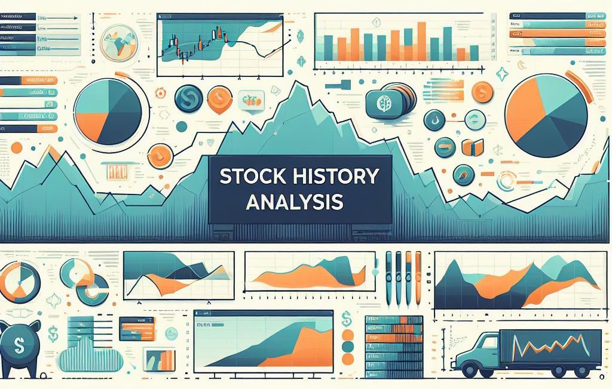

<!-- PROJECT LOGO -->
 

  <h1 align="center">Stock History Analysis</h1>

<!-- PROJECT LOGO -->

## Overview
The Stock History Analysis project aims to determine the preferred portfolio composition from constituents within the S&P 500 index. This is achieved by analyzing historical stock data using various technical analysis models. The project is currently in its initial iteration and is a work in progress.

## Project Structure
The project is structured as a Jupyter notebook (`stock-history.ipynb`) containing the necessary code to fetch, process, and analyze stock data. The notebook is divided into several cells, each performing specific tasks as part of the overall analysis.

### Key Components
- **Library Imports**: Essential libraries such as `yfinance`, `pandas`, and `json` are imported to handle data retrieval, manipulation, and storage.
- **Data Retrieval**: The `get_stock_data` function fetches historical stock data for a given ticker and period using the `yfinance` library.
- **Data Processing**: The retrieved data is cleaned and processed to calculate various metrics like closing price, percentage change, holding period yield, holding period return, and portfolio value assuming an initial investment of $1000.
- **Ticker Symbol Reading**: The `read_ticker_symbols` function reads ticker symbols from a CSV file, which allows for batch processing of multiple stocks.
- **Main Execution**: The main block of the notebook orchestrates the reading of ticker symbols and the retrieval of stock data for each symbol. The results are then appended to a list and printed in JSON format.

## Objectives
The primary objective of this iteration is to:
- Retrieve and clean historical stock data for analysis.
- Calculate key financial metrics that will serve as inputs for technical analysis models.
- Prepare the groundwork for integrating various technical analysis models in future iterations.

## Usage
To use this project, follow these steps:
1. Ensure you have Jupyter Notebook or JupyterLab installed.
2. Clone the repository and navigate to the project directory.
3. Open the `stock-history.ipynb` notebook.
4. Run the cells in sequence to perform the analysis.

## Future Work
The next steps for this project include:
- Integration of technical analysis models to evaluate stock performance.
- Optimization of portfolio composition based on historical performance and technical indicators.
- Development of a user interface to interact with the analysis results.
- Expansion of the dataset to include additional financial metrics and a broader range of stocks.

## Contributions
Contributions are welcome. If you would like to contribute to the project, please fork the repository and submit a pull request with your proposed changes.

## License
This project is open source and available under the [MIT License](LICENSE.md).

## Contact
For any queries or discussions regarding the project, please open an issue in the repository.

## Acknowledgments
- Data provided by [Yahoo Finance](https://finance.yahoo.com/) via the `yfinance` library ([GitHub Repo](https://github.com/ranaroussi/yfinance)).
- S&P 500 company list sourced from the publicly available dataset on GitHub, provided by Rufus Pollock and the Open Knowledge Foundation ([GitHub Repo](https://github.com/datasets/s-and-p-500-companies/)).

---

**Note**: This project is in the early stages of development and is subject to significant changes. The current functionality is limited to data retrieval and preliminary processing. Users should be aware that the analysis models are not yet implemented, and the results should not be used for actual trading or investment decisions.
